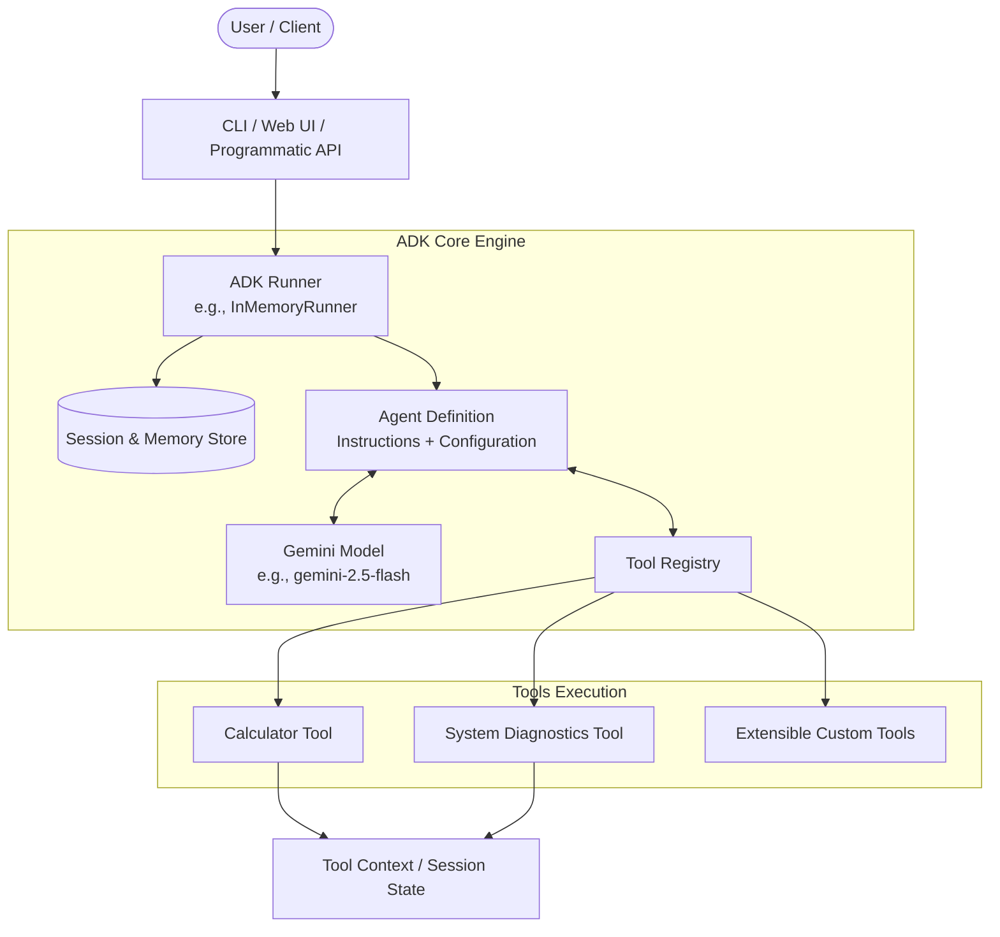
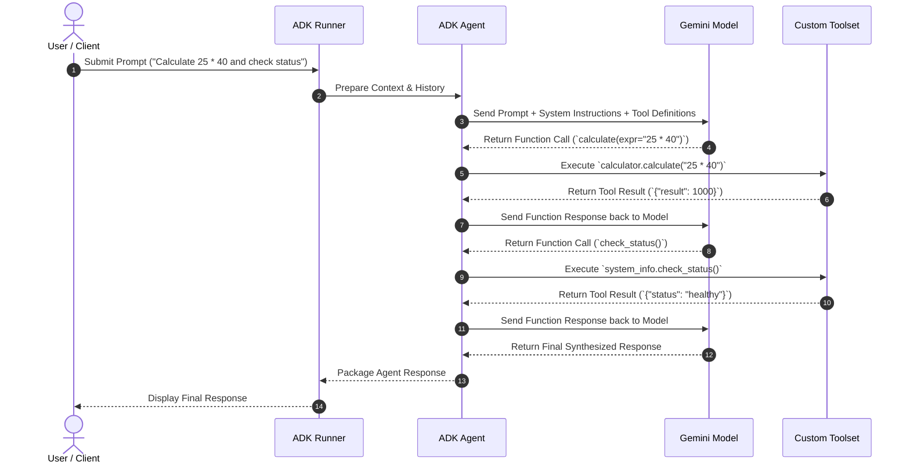

# System Architecture: Google ADK Test Application

This document outlines the architectural design, core concepts, and runtime mechanics of the test application built on Google's **Agent Development Kit (ADK)**.

---

## 1. Google ADK Architectural Overview

The Google Agent Development Kit (ADK) is an open-source, code-first Python framework built to streamline agentic workflows. Rather than treating agents as black-box abstractions, ADK provides modular, inspectable primitives:

### 1.1 The Core Components

#### 1. The `Agent` (`google.adk.agents.Agent`)
- Defines the agent's identity, system prompt (`instruction`), targeted foundation model (e.g. `gemini-2.5-flash`), and available tools.
- Encapsulates how prompts are contextualized and which tool schemas are supplied to the LLM during generation calls.

#### 2. Tools & Toolsets (`google.adk.tools`)
- Python functions with type annotations and docstrings converted into function declarations (JSON schema) for LLM function calling.
- Supports **ToolContext**: allows tools to read or update the agent's ongoing session state dynamically during execution.
- Integrates with external protocols including Model Context Protocol (MCP) and OpenAPI specs.

#### 3. Runners (`google.adk.runners`)
- Orchestration engine responsible for managing conversation lifecycle, execution loops, function call dispatching, and turn management.
- **`InMemoryRunner`**: Provides lightweight, in-memory session persistence, ideal for local testing, rapid iteration, and integration tests.
- Handles multi-turn tool loops: receiving a model's `function_call`, executing the registered Python function, feeding the `function_response` back to the model, and repeating until a final text response is produced.

#### 4. Sessions & Context
- Sessions maintain conversational history, tool outputs, and execution telemetry across multiple user turns.

---

## 2. Request & Execution Lifecycle

The sequence below illustrates the end-to-end flow when a user sends a prompt that requires tool interaction:

---

## 3. Test Application Design

The test application implements a foundational pattern for building and evaluating agents before deploying to production environments (such as Google Cloud Run or Vertex AI Agent Engine).

### 3.1 Modular Organization

1. **Agent Specification Layer (`app/agent.py`)**:
   - Declares the `root_agent` instance.
   - Sets deterministic instructions and specifies tool dependencies.

2. **Capability Layer (`app/tools/`)**:
   - `calculator.py`: Safe expression evaluation, handling edge cases (division by zero, syntax errors).
   - `system_info.py`: Inspection of environment parameters, system uptime, and test telemetry.

3. **Execution Layer (`app/runner.py` & `main.py`)**:
   - Instantiates `InMemoryRunner`.
   - Provides a conversational REPL loop for interactive terminal testing.
   - Exposes clean APIs for automated testing and programmatic invocation.

---

## 4. Development Interfaces

Google ADK provides three primary runtime modes:

| Mode | Command | Description |
| :--- | :--- | :--- |
| **Interactive CLI** | `python main.py` | Command-line REPL for direct terminal interaction with the agent |
| **ADK Web UI** | `adk web app/agent.py` | Google ADK built-in web playground for visual debugging and inspecting tool calls |
| **Automated Tests** | `pytest tests/` | Automated verification of tool schemas, edge cases, and agent responses |

---

## 5. Security & Best Practices

- **Credential Management**: API keys (`GOOGLE_API_KEY`) must never be committed to Git. All secrets are managed via `.env` and excluded via `.gitignore`.
- **Tool Guardrails**: Custom tools must validate inputs, avoid unsafe execution primitives (like unrestricted `eval`), and return structured error dictionaries instead of throwing uncaught exceptions.
- **Model Agnosticism**: While optimized for Gemini, the architecture isolates tool definitions and runners, allowing straightforward adaptation to other models supported by ADK.
