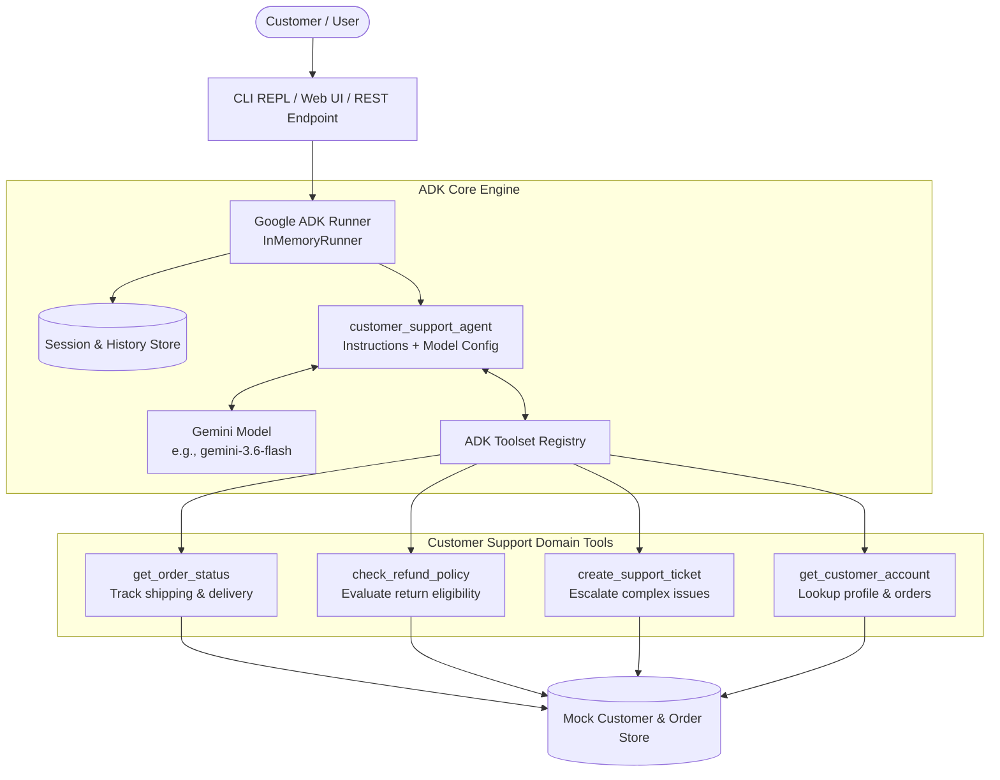
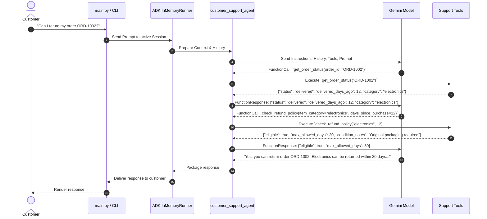

# System Architecture: Google ADK Customer Support Agent

This document outlines the architecture, components, data flows, and runtime mechanics of the **`customer_support_agent`** application built with Google's **Agent Development Kit (ADK)**.

---

## 1. System Architecture

The `customer_support_agent` acts as an automated, empathic front-line support assistant. It uses Google ADK to process customer queries, maintain conversation state, invoke domain-specific tools, and formulate helpful, grounded responses.

---

## 2. Core Components

### 2.1 The Agent (`google.adk.agents.Agent`)
- **Identifier**: `customer_support_agent`
- **Model**: Default `gemini-3.6-flash` (or `gemini-1.5-flash`)
- **System Instructions**: Configured with customer service guidelines: polite tone, factual precision, mandatory tool verification for account/order inquiries, and standard escalation procedures when unable to resolve an issue directly.

### 2.2 Domain Toolsets (`app/tools/`)
ADK exposes Python functions directly to Gemini as callable tools:

1. **`get_order_status(order_id: str)`**:
   - Queries tracking details, carrier status, expected delivery date, and order items.
2. **`check_refund_policy(item_category: str, days_since_purchase: int)`**:
   - Evaluates eligibility according to policy rules (e.g., 30 days for electronics, 45 days for apparel, non-returnable final sale items).
3. **`create_support_ticket(customer_id: str, issue_summary: str, priority: str)`**:
   - Formally generates a support ticket for human representative review when automated resolution is impossible.
4. **`get_customer_account(email_or_id: str)`**:
   - Fetches customer account information, membership tier, and recent order history.

### 2.3 Runner & Session Management (`google.adk.runners.InMemoryRunner`)
- Manages multi-turn conversations where previous answers, customer IDs, or order numbers remain accessible in conversation memory.
- Orchestrates the tool invocation loop:
  1. User asks a question.
  2. Model detects need for tools and outputs `FunctionCall`.
  3. ADK Runner executes the tool locally.
  4. Tool output is injected as `FunctionResponse`.
  5. Model synthesizes the final customer-facing reply.

---

## 3. Interaction Sequence Diagram

Below is the workflow for a customer inquiring about an order's return eligibility:

---

## 4. Resilience & Error Handling

- **Invalid Order/Account IDs**: Tools return clear structured error dictionaries (`{"success": false, "error": "Order not found"}`) allowing the agent to guide the user to verify their ID.
- **Graceful Escalation**: If a customer is dissatisfied or an unexpected exception occurs, the agent proactively offers to call `create_support_ticket`.
- **API Key Security**: Sensitive credentials stay in `.env` and are never logged or exposed in prompts.
