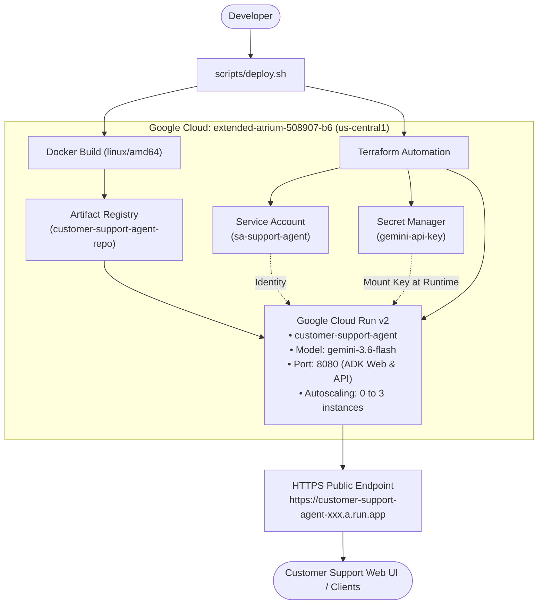

# Deployment Guide: Google Cloud Run with Terraform

This guide covers deploying the **`customer_support_agent`** application to Google Cloud project **`extended-atrium-508907-b6`** using **Terraform (Infrastructure as Code)** and **Google Cloud Run**.

---

## 1. Cloud Architecture



---

## 2. Prerequisites

Ensure you have the following installed on your machine:

1. **Docker**: Running locally (`docker --version`).
2. **Google Cloud CLI (`gcloud`)**:
   ```bash
   brew install --cask google-cloud-sdk
   ```
3. **Terraform**:
   ```bash
   brew tap hashicorp/tap
   brew install hashicorp/tap/terraform
   ```

---

## 3. Google Cloud Authentication

Authenticate your local environment with your Google Cloud account:

```bash
# 1. Authenticate user account
gcloud auth login

# 2. Authenticate Application Default Credentials (for Terraform)
gcloud auth application-default login

# 3. Set the active GCP project
gcloud config set project extended-atrium-508907-b6
```

---

## 4. Option A: Fast-Track Deployment (One-Click Script)

We provide an automated script that configures Artifact Registry, builds the container image, pushes it, and runs Terraform:

```bash
./scripts/deploy.sh
```

---

## 5. Option B: Step-by-Step Manual Deployment

### Step 1: Authenticate Docker with Google Artifact Registry

```bash
gcloud auth configure-docker us-central1-docker.pkg.dev --quiet
```

### Step 2: Build the Container Image

> [!IMPORTANT]
> Always build with `--platform linux/amd64` when deploying from Apple Silicon Macs so the image matches Cloud Run's architecture.

```bash
docker build --platform linux/amd64 \
  -t us-central1-docker.pkg.dev/extended-atrium-508907-b6/customer-support-agent-repo/customer-support-agent:latest .
```

### Step 3: Push Image to Artifact Registry

```bash
docker push us-central1-docker.pkg.dev/extended-atrium-508907-b6/customer-support-agent-repo/customer-support-agent:latest
```

### Step 4: Configure Terraform Variables

Navigate to the `terraform/` directory:
```bash
cd terraform
cp terraform.tfvars.example terraform.tfvars
```

Edit `terraform.tfvars` and set your Gemini API key:
```hcl
project_id     = "extended-atrium-508907-b6"
region         = "us-central1"
service_name   = "customer-support-agent"
adk_model      = "gemini-3.6-flash"
gemini_api_key = "AIzaSy...your_gemini_key_here"
```

### Step 5: Initialize and Apply Terraform

```bash
# Initialize providers and state backend
terraform init

# Review proposed infrastructure changes
terraform plan

# Provision resources on Google Cloud
terraform apply -auto-approve
```

---

## 6. Accessing Your Deployed Agent

Once `terraform apply` finishes, it outputs the live service URL:

```bash
terraform output cloud_run_url
# Example: https://customer-support-agent-w34gfe23-uc.a.run.app
```

Open the URL in your browser:
- The **Google ADK Web UI** is immediately available.
- **Model Armor** actively screens all customer messages.
- **Agent Gateway** guards tool executions and egress responses.

---

## 7. Cost & Resource Optimization

- **Scale-to-Zero (`min_instances = 0`)**: The service automatically scales down to 0 instances when idle, incurring **$0 in compute costs**.
- **Autoscaling Limit (`max_instances = 3`)**: Protects your project against unexpected spikes or runaway traffic.
- **Secret Manager**: The API key is never baked into the Docker image or exposed in source code.

---

## 8. Teardown / Destroy Infrastructure

To clean up all deployed resources and prevent any ongoing costs:

```bash
cd terraform
terraform destroy -auto-approve
```
